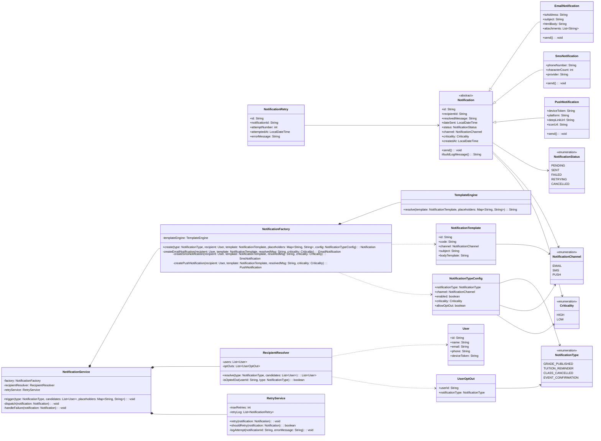

# Class Diagram Review

## What feels off

- `AuditLog` is a cross-cutting concern, not part of the notification domain itself. Keep it only if you need compliance, traceability, or support diagnostics. Otherwise it adds noise and couples the model to persistence history.
- `recipientRole` in `Notification` is too rigid. A notification should represent a single recipient, not a role bucket. Role-based routing belongs in recipient selection, before the notification exists.
- `UserRole` is only worth keeping if roles are used elsewhere, like authorization or business workflows. For delivery alone, routing to an explicit recipient list is cleaner and easier to evolve.
- `code` on `Notification` overlaps with `NotificationTemplate.code`. That makes the model harder to read. One identifier is usually enough unless both values have different business meanings.
- `NotificationService` is doing the right kind of orchestration, but it should stay the only place that coordinates template resolution, recipient filtering, creation, and dispatch.

## Suggested direction

- Keep notifications per recipient.
- Resolve the eligible users first, then create one notification per user.
- Keep audit as an infrastructure concern if you still need it.
- Keep roles only if they serve another part of the system. If they exist only for notification routing, replace them with a candidate recipient list.

If you still need audit, add it as a separate infrastructure service instead of baking it into the core notification model. If you later need role-based targeting, model that as an audience rule or recipient selector rather than attaching roles directly to the notification itself.
